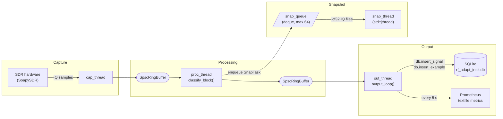

# RF Process Worker (`rf_adapt_intel`)

[](https://github.com/foxrouter/meek/actions/workflows/ci.yml)

A C++20 RF signal-processing worker that captures IQ samples via SoapySDR,
classifies modulation (GMSK/FSK/PSK/QAM/OOK), and persists results to SQLite.
Deployed as a hardened systemd service on embedded Linux (Raspberry Pi and Ubuntu server).

## Installation

> **New here?** See the step-by-step [Installation Guide](docs/INSTALL.md) for
> detailed instructions for **Raspberry Pi OS Bookworm 64-bit** and
> **Ubuntu Server Noble 24.04**.

### Quick install (automated)

```bash
git clone https://github.com/foxrouter/meek.git
cd meek
sudo bash install.sh          # detects OS, installs deps, builds, deploys service
```

Add `--all-decoders` to also install multimon-ng, rtl_433, and liquid-dsp:

```bash
sudo bash install.sh --all-decoders
```

Use `--dry-run` to preview every step without making changes:

```bash
bash install.sh --dry-run
```

See `bash install.sh --help` or [docs/INSTALL.md](docs/INSTALL.md) for full options
and troubleshooting.

---

## Table of contents

- [Architecture](#architecture)
- [Layout](#layout)
- [Prerequisites](#prerequisites)
- [Build](#build)
- [Quickstart](#quickstart)
- [Multi-band rotation](#multi-band-rotation-band-scheduler)
- [Optional decoder setup](#optional-decoder-setup-opssetupsh)
- [Offline IQ metrics](#offline-iq-metrics-toolsiq_metricscpp)
- [Offline RF audit](#offline-rf-audit-srcrf_auditcpp)
- [Offline IQ analysis](#offline-iq-analysis-toolsdecode_candidatespy)
- [HTML signal report](#html-signal-report-toolsmeek_reportpy)
- [Canary procedure](#canary-procedure-opscanarysh)
- [IQ file transfer](#iq-file-transfer-scriptstransfer_iqsh)
- [Test harnesses](#test-harnesses)
- [Container build](#container-build)
- [Sensitive-data guidance](#sensitive-data-guidance)

## Layout

> **Full per-file documentation:** see [docs/codebase.md](docs/codebase.md) for
> a detailed guide to every directory, source file, header, and script.

```
benchmarks/               Python-vs-C++ benchmark scripts and results
config/                   runtime configuration example
docs/                     design plan, codebase guide, and gap tracking
ops/                      deploy, verify, setup, and canary helpers
scripts/                  IQ ingest, metrics, heartbeat, and transfer helpers
src/                      C++ worker source (main.cpp daemon + rf_audit.cpp CLI tool)
systemd/                  systemd unit and drop-in files
tests/                    Python and shell test harnesses
tools/                    offline decode/audit utilities
```

Key files:

| Path | Purpose |
|---|---|
| `src/main.cpp` | Core capture + classification + DB persistence daemon |
| `src/rf_audit.cpp` | Standalone C++ RF audit CLI (no hardware required) |
| `include/meek/classifier.hpp` | Feature extraction and modulation classifier (`classify_block`) |
| `include/meek/demod_chains.hpp` | liquid-dsp FSK / PSK-QAM / OOK-AM demodulation chains (`HAVE_LIQUID`) |
| `include/meek/db.hpp` | SQLite3 RAII wrapper (WAL mode, prepared statements) |
| `include/meek/metrics.hpp` | Prometheus metrics (`ProcMetrics`, textfile writer, optional HTTP server) |
| `include/meek/band_profiles.hpp` | 39-entry UK band profile table (`kUkBands`) |
| `include/meek/band_scheduler.hpp` | Multi-band rotation scheduler (`BandScheduler`, `RF_SCHED_BANDS`) |
| `include/meek/isdr_source.hpp` | SDR hardware abstraction (`ISdrSource` / `SoapySdrSource`) |
| `include/meek/ring_buffer.hpp` | Lock-free SPSC ring buffer (`SpscRingBuffer<T, 64>`) |
| `include/meek/sample_types.hpp` | Core pipeline data types (`SampleBlock`, `ClassificationResult`, `ModClass`) |
| `include/meek/config.hpp` | Runtime configuration from environment variables |
| `tools/iq_metrics.cpp` | Standalone C++ IQ metrics tool (avg_power, snr_db, spectral_flatness, est_bw_hz) |
| `tools/decode_candidates.py` | Offline modulation decode + JSON audit report |
| `tools/meek_report.py` | Self-contained HTML signal intelligence report from the SQLite DB |
| `tools/autotune_thresholds.py` | Threshold optimisation from IQ snapshots |
| `docs/INSTALL.md` | **Step-by-step installation guide** (Bookworm & Noble) |
| `docs/rf-adapt-intel-plan.md` | Full design plan and execution status |
| `docs/missing-features.md` | Gaps and pending implementation items |
| `docs/audit.md` | Production-readiness audit, dependency map, and migration notes |
| `install.sh` | **Automated one-shot installer** (detects OS, builds, deploys) |
| `config/thresholds.env.example` | Runtime knobs (copy to `/etc/rf_worker/thresholds.env`) |
| `systemd/process-worker.service` | Hardened systemd unit |
| `systemd/process-worker.service.d/` | Drop-in overrides (hardening, env, processor) |
| `ops/deploy.sh` | Atomic service install |
| `ops/setup.sh` | Optional decoder installer |
| `ops/verify.sh` | Hardening verification |
| `ops/canary.sh` | Canary lifecycle (enable/status/promote/rollback) |
| `scripts/process_incoming.sh` | Band-aware offline IQ file processor |
| `scripts/heartbeat_and_metrics.sh` | Standalone heartbeat + Prometheus metrics writer |
| `scripts/transfer_iq.sh` | rsync IQ snapshot files from edge (Ray) to server (Brian) |
| `scripts/deploy_and_restart.sh` | Build, install binary, and restart service |
| `tests/gen_test_signals.py` | Synthetic RRC-shaped IQ vector generator |
| `tests/test_iq_metrics.py` | Validates C++ `iq_metrics` output against the Python reference |
| `benchmarks/bench_iq_metrics.py` | Python-vs-C++ throughput benchmark for IQ metrics |

## Architecture

The worker runs a three-stage lock-free pipeline:



Key design decisions:
- **Lock-free ring buffers** (`SpscRingBuffer<T, 64>`) decouple capture, processing, and output at runtime.
- **SQLite writes** happen exclusively on the output thread, preventing contention with the capture thread.
- **Snapshot worker** (`snap_thread`, `std::jthread`) handles IQ snapshot I/O from a `SpscRingBuffer<SnapTask, 64>` (up to 63 usable slots) without blocking the processing thread.
- **Cooperative shutdown** via the `g_shutdown` atomic flag and `std::stop_token` lets all threads drain cleanly on `SIGINT`/`SIGTERM`.
- **39 band profiles** (`kUkBands`) provide per-band SNR, bandwidth, and prior-boost parameters for the classifier.
- **Multi-band rotation** (`BandScheduler`) retunes the SDR across a user-defined list of frequencies on a configurable dwell schedule, with no mutex required (single-threaded ownership inside `capture_loop`).

## Prerequisites

> For a guided setup walkthrough see [docs/INSTALL.md](docs/INSTALL.md).

| Component | Minimum version | Notes |
|---|---|---|
| GCC or Clang | C++20 capable | see [Compiler requirements](#compiler-requirements) |
| CMake | 3.25 | Build system |
| SoapySDR | any | `libsoapysdr-dev` on Debian/Ubuntu |
| SQLite 3 | any | `libsqlite3-dev` |
| Python 3 | 3.8+ | For tests and tools (`numpy` required) |
| liquid-dsp | optional | Advanced demodulation — see [Optional decoder setup](#optional-decoder-setup-opssetupsh) |

### Compiler requirements
- GCC ≥ 12 or Clang ≥ 14 (C++20 stdlib required)
- On Raspberry Pi OS Bookworm the default GCC (12) satisfies this requirement

On Raspberry Pi OS Bookworm:

```bash
sudo apt install -y build-essential cmake pkg-config \
    libsoapysdr-dev soapysdr-tools soapysdr-module-rtlsdr \
    libsqlite3-dev python3 python3-numpy \
    rtl-sdr librtlsdr-dev inotify-tools rsync
```

On Ubuntu Noble (24.04) or later (default GCC is already ≥ 12):

```bash
sudo apt install -y build-essential cmake pkg-config \
    libsoapysdr-dev soapysdr-tools soapysdr-module-rtlsdr \
    libsqlite3-dev python3 python3-numpy \
    rtl-sdr librtlsdr-dev inotify-tools rsync
```

## Build

```bash
mkdir build && cd build
cmake -S .. -B . -DCMAKE_BUILD_TYPE=Release
cmake --build . -- -j$(nproc)
```

If liquid-dsp is installed, CMake will detect it automatically and enable `HAVE_LIQUID`.

Install the binary to `/usr/local/bin/`:

```bash
sudo cmake --install .
```

### CMake build options

| Option | Default | Description |
|---|---|---|
| `BUILD_HARDWARE_TARGETS` | `ON` | Build `rf_adapt_intel` and `soapy_read_test` (requires SoapySDR). Set `OFF` in CI or on machines without SDR hardware. |
| `ENABLE_SANITIZERS` | `OFF` | Compile with AddressSanitizer and UndefinedBehaviorSanitizer (Clang recommended). |
| `BUILD_OFFLINE` | `OFF` | Disable FetchContent network access for air-gapped builds. Requires dependency source directories to already be present locally (for example under `build/_deps/` or via `FETCHCONTENT_SOURCE_DIR_<name>` overrides). |

Build only `iq_metrics` (no SDR hardware required):

```bash
cmake -S . -B build -DBUILD_HARDWARE_TARGETS=OFF
cmake --build build -t iq_metrics
```

## Quickstart

1. Copy `config/thresholds.env.example` to `/etc/rf_worker/thresholds.env` (or keep in `config/` — **git-ignored**).
2. *(Optional)* Install optional decoders: `sudo bash ops/setup.sh`
3. Install systemd unit/drop-ins: `sudo bash ops/deploy.sh`
4. Run `ops/verify.sh` to confirm hardening.
5. Ingest a sample IQ: `bash scripts/process_incoming.sh /path/to/file.raw`
6. Metrics/heartbeat: `bash scripts/heartbeat_and_metrics.sh` (optional background service)

## Multi-band rotation (Band Scheduler)

`BandScheduler` rotates the SDR centre frequency through a configurable list
of bands on a per-slot dwell schedule.  It is owned exclusively by
`capture_loop` (no mutex required) and calls
`ISdrSource::set_center_freq()` when a dwell period expires.

Set two environment variables to enable rotation:

```bash
# /etc/rf_worker/thresholds.env

# Comma-separated centre frequencies in Hz (at least 2 required)
RF_SCHED_BANDS=433920000,868100000,144800000

# Dwell time per slot in milliseconds (same for all slots; default 10 000 ms)
RF_SCHED_DWELL_MS=5000
```

When `RF_SCHED_BANDS` contains fewer than two valid frequency values,
scheduling is disabled with `[SCHED] WARN` messages and the daemon
continues operating on its configured single center frequency as normal.

Per-band classification quality is maintained because `proc_loop` calls
`find_band(blk.center_freq_hz)` on every block to look up the matching
`BandProfile` SNR gate, bandwidth hint, and prior-boost — regardless of
whether multi-band rotation is enabled.

## Optional decoder setup (`ops/setup.sh`)

`ops/setup.sh` guides you through installing optional decoders that extend the
classification pipeline.  It can be run interactively or fully non-interactively
via CLI flags.

### Platform requirements
- Linux (Raspberry Pi OS Bookworm 64-bit recommended)
- Minimum 4 GB RAM (required for the liquid-dsp build step)

### Available decoders

| Decoder | Flag | Method | Adds |
|---|---|---|---|
| **multimon-ng** | `--install-multimon-ng` | `apt install multimon-ng` | POCSAG / FLEX / OOK protocol decoding |
| **rtl_433** | `--install-rtl_433` | `apt install rtl-433` | OOK/ASK ISM-433 device packets |
| **liquid-dsp** | `--install-liquid-dsp` | build from source | Advanced GMSK / PSK demodulation |

### Usage examples

```bash
# Interactive mode (TTY required — prompts for each decoder)
sudo bash ops/setup.sh

# CLI flags — fully non-interactive, install specific decoders
sudo bash ops/setup.sh --non-interactive --install-multimon-ng --install-rtl_433

# Install all optional decoders non-interactively
sudo bash ops/setup.sh --non-interactive \
  --install-multimon-ng --install-rtl_433 --install-liquid-dsp

# Preview what would happen without making changes
sudo bash ops/setup.sh --non-interactive --install-liquid-dsp --dry-run

# Deploy service and run setup in one step
sudo bash ops/deploy.sh --setup
```

After setup, decoder binary paths are written to `/etc/rf_worker/thresholds.env`
so the `process-worker` systemd service picks them up automatically.

## Offline IQ metrics (`tools/iq_metrics.cpp`)

`iq_metrics` is a standalone C++20 tool that reads raw CF32 IQ snapshot files
and computes four signal metrics: `avg_power`, `snr_db`, `spectral_flatness`,
and `est_bw_hz`.  It mirrors the Python reference in
`tools/autotune_thresholds.py` and is validated against it by
`tests/test_iq_metrics.py`.

### Build

```bash
cmake -S . -B build -DBUILD_HARDWARE_TARGETS=OFF
cmake --build build -t iq_metrics
```

### Usage

```bash
# Analyse a single IQ snapshot (default sample rate: 2 048 000 Hz)
./build/iq_metrics /var/lib/rf-adapt-intel/snapshots/snap_*.cf32

# Specify sample rate and block size
./build/iq_metrics --sample-rate 2048000 --block-size 4096 file.cf32

# Batch: analyse multiple files
./build/iq_metrics snap1.cf32 snap2.cf32

# Show usage
./build/iq_metrics --help
```

Output is JSON on stdout, for example:

```json
[
  {
    "file": "snap_1234_c85.cf32",
    "n_samples": 65536,
    "avg_power": -12.3,
    "snr_db": 18.7,
    "spectral_flatness": 0.21,
    "est_bw_hz": 145000.0
  }
]
```

### Benchmark

```bash
python3 benchmarks/bench_iq_metrics.py build/iq_metrics \
    --repetitions 20 \
    --block-sizes 1024,4096,16384,65536
```

The benchmark compares per-block latency of the C++ tool against the Python
reference and writes JSON results to `benchmarks/results/`.

---

## Offline RF audit (`src/rf_audit.cpp`)

`rf_audit` is a standalone C++20 CLI tool that reads raw CF32 IQ snapshot
files, classifies the modulation using the same heuristic classifier as the
daemon, matches the centre frequency against the UK band profile table, and
emits one JSON object per file on stdout.

Build:
```bash
# With SoapySDR installed
cmake -S . -B build -DCMAKE_BUILD_TYPE=Release
cmake --build build --target rf_audit -- -j"$(nproc)"

# Tool-only / offline build on systems without SoapySDR
cmake -S . -B build -DCMAKE_BUILD_TYPE=Release -DBUILD_HARDWARE_TARGETS=OFF
cmake --build build --target rf_audit -- -j"$(nproc)"
```

Usage:
```bash
./build/rf_audit [options] <file1.cf32> [file2.cf32 ...]

Options:
  --sample-rate FS     Sample rate in Hz (default: 2048000)
  --center-freq HZ     Centre frequency for band matching (default: 0)
  --block-size N       Analyse only the first N samples (0 = all)
  --snr-min DB         SNR gate threshold in dB (default: 0.0)
  --conf-threshold T   Minimum confidence to flag as candidate (default: 0.0)
  --pretty             Pretty-print JSON output
  --help               Show this help message and exit
```

Output fields per file include: `file`, `n_samples`, `sample_rate_hz`,
`center_freq_hz`, `mod`, `confidence`, `snr_db`, `avg_power`, `papr_db`,
`spectral_flatness`, `occupied_bw_hz`, `time_occupancy`, `avg_abs_phase`,
`trans_ratio`, `p50`, `p90`, `decision_trace`, `snr_gate_pass`,
`bw_gate_pass`, and `is_candidate`. When `--center-freq` matches a profile
in `kUkBands`, the output also includes `band` and `band_notes`.

Exit codes: 0 = all files processed, 1 = one or more files failed,
2 = usage error.

---

## Offline IQ analysis (`tools/decode_candidates.py`)

`decode_candidates.py` retrieves candidate signal records from the SQLite
database, locates matching IQ snapshot files, and attempts modulation decoding
using built-in Python decoders (and optional external tools).  It produces a
verifiable JSON audit report.

### Basic usage

```bash
# Analyse candidates in the default database with default snapshot directory
python3 tools/decode_candidates.py

# Specify a custom database, snapshot dir, and output file
python3 tools/decode_candidates.py \
    --db rf_adapt_intel.db \
    --snapshot-dir /var/lib/rf-adapt-intel/snapshots \
    --out /tmp/audit_report.json \
    --sample-rate 2048000 \
    --min-confidence 0.6

# Also invoke external decoders (multimon-ng, rtl_433) where installed
python3 tools/decode_candidates.py --external

# Process only the 20 most recent candidates
python3 tools/decode_candidates.py --limit 20
```

### Output format

The tool writes a JSON file with an array of `candidate` objects.  Each entry
includes: `signal_id`, `timestamp`, `mod_class`, `confidence`, `snapshot_file`,
`decoder_used`, `result`, and `notes`.

### Offline file-replay via `process_incoming.sh`

`scripts/process_incoming.sh` runs offline analysis automatically when
`tools/decode_candidates.py` and `python3` are available:

```bash
# Analyse an existing IQ snapshot file offline
OUTPUT_DIR=/tmp/processed bash scripts/process_incoming.sh /path/to/433_signal.raw

# Point at an existing database for candidate lookup
REPLAY_DB=/var/lib/rf-adapt-intel/rf_adapt_intel.db \
  bash scripts/process_incoming.sh /path/to/433_signal.raw
```

## HTML signal report (`tools/meek_report.py`)

`meek_report.py` generates a self-contained HTML signal intelligence report
from the SQLite database.  No external web framework is required — the output
is a single `.html` file with detection summaries, per-band breakdowns,
confidence histograms, and decision-trace samples.

```bash
# Generate with default database path; writes ~/meek_report.html
python3 tools/meek_report.py

# Custom database, date range, and output path
python3 tools/meek_report.py \
    --db /var/lib/rf-adapt-intel/rf_adapt_intel.db \
    --days 7 \
    --out /tmp/report.html
```

## Canary procedure (`ops/canary.sh`)

`ops/canary.sh` manages the canary deployment lifecycle — enabling passive
capture mode, monitoring FP/FN rates, promoting to production, and rolling back.

```bash
# Enable canary mode (sets RF_SNR_MIN_DB=0, restarts service)
sudo bash ops/canary.sh

# Check current FP/FN counters, CPU/memory usage, and lock-fail metrics
sudo bash ops/canary.sh --status

# Promote canary config to production (removes the canary drop-in)
sudo bash ops/canary.sh --promote

# Roll back to the last backed-up production config
sudo bash ops/canary.sh --rollback
```

Promotion criteria (all must be met before `--promote`):
- Classifier >= 95 % accuracy at >= 0 dB SNR.
- False-positive / rejection rate < 3 % over the monitoring window.
- CPU usage < 80 % on target host.
- No lock-fail counter increases in the last 30 minutes.

## IQ file transfer (`scripts/transfer_iq.sh`)

Transfer IQ snapshot files from Ray (edge SDR) to Brian (central server) via
rsync with retries, bandwidth limiting, and logging.  When `DB_DEST` is set,
the SQLite classifications DB is also synced to Brian after each transfer batch
so that the reporting node receives recent classification data; DB sync is
skipped silently when `DB_DEST` is unset.  When `sqlite3` is available a
consistent snapshot is created via `sqlite3 .backup` (online backup API) before
rsyncing; this holds only brief shared locks and avoids a full DB rewrite.
Otherwise the script falls back to rsyncing the live DB and WAL/SHM sidecars
(which may be racy under write load).  DB sync failures are logged but do not
abort IQ transfers.

Key environment variables and CLI flags for DB sync:
- `DB_SOURCE` / `--db-source` — local path to the SQLite DB (default: `/var/lib/rf-adapt-intel/rf_adapt_intel.db`)
- `DB_DEST` / `--db-dest` — rsync destination for the DB snapshot; DB sync is skipped when unset
- `DB_SYNC_INTERVAL` *(env only)* — minimum seconds between DB syncs in watch mode (default: 60)

```bash
# One-shot transfer of all files in the snapshot directory
IQ_DEST=rf_worker@<brian_host>:/var/lib/rf-adapt-intel/incoming/ \
  bash scripts/transfer_iq.sh

# Also sync the classifications DB to Brian after the sweep
IQ_DEST=rf_worker@<brian_host>:/var/lib/rf-adapt-intel/incoming/ \
DB_DEST=rf_worker@<brian_host>:/var/lib/rf-adapt-intel/rf_adapt_intel.db \
  bash scripts/transfer_iq.sh

# Continuous watcher: transfer new files as they arrive (requires inotify-tools)
# After new IQ files are transferred, the DB is synced to Brian, but no more often than once
# every DB_SYNC_INTERVAL seconds
IQ_DEST=rf_worker@<brian_host>:/var/lib/rf-adapt-intel/incoming/ \
DB_DEST=rf_worker@<brian_host>:/var/lib/rf-adapt-intel/rf_adapt_intel.db \
  bash scripts/transfer_iq.sh --watch

# Limit bandwidth to 512 kbps and use 5 retries
bash scripts/transfer_iq.sh --dest user@host:path --bwlimit 512 --retries 5

# Dry-run (prints rsync commands without executing)
bash scripts/transfer_iq.sh --dest user@host:path --dry-run
```

## Test harnesses

All Python tests use the standard `unittest` module and require only `numpy`.

```bash
# SNR sweep: accuracy and FP rate across all modulations and SNR levels
python3 tests/test_snr_sweep.py -v

# Guardrail rejection tests (SNR gate, BW gate, PAPR_MAX)
python3 tests/test_guardrails.py -v

# BER and CRC-32 validation for each demod chain
python3 tests/test_demod_ber.py -v

# Throughput benchmark (frames per minute)
python3 tests/bench_throughput.py -v

# Validate C++ iq_metrics output against the Python reference
cmake -S . -B build -DBUILD_HARDWARE_TARGETS=OFF && cmake --build build -t iq_metrics
python3 tests/test_iq_metrics.py build/iq_metrics -v

# Shell tests for ops/setup.sh
bash tests/test_setup.sh -v

# Run all tests via CTest (after cmake build)
cmake --build build --target test
```

Generate synthetic IQ test vectors:

```bash
# Generate RRC-shaped vectors for all supported bands and modulations
python3 tests/gen_test_signals.py
```

## Container build

A `Dockerfile` is provided for reproducible builds and testing without
installing any host dependencies.  It builds `iq_metrics` and runs all Python
tests at image build time.

```bash
# Build the image (runs all tests as part of the build)
docker build -t rf-adapt-intel:latest .

# Run the full CTest suite inside the container
docker run --rm rf-adapt-intel:latest ctest --test-dir /build -V
```

### Running `iq_metrics` inside the container

```bash
# Analyse IQ snapshot files from the host (mount the directory read-only)
docker run --rm \
  -v /var/lib/rf-adapt-intel/snapshots:/snapshots:ro \
  rf-adapt-intel:latest \
  /build/iq_metrics /snapshots/snap_*.cf32

# Override sample rate
docker run --rm \
  -v /var/lib/rf-adapt-intel/snapshots:/snapshots:ro \
  rf-adapt-intel:latest \
  /build/iq_metrics --sample-rate 2048000 /snapshots/snap_*.cf32
```

### Running `decode_candidates` inside the container

```bash
# Mount the database and snapshots directory; write the report to a host path
docker run --rm \
  -v /var/lib/rf-adapt-intel:/data:rw \
  rf-adapt-intel:latest \
  python3 /src/tools/decode_candidates.py \
    --db /data/rf_adapt_intel.db \
    --snapshot-dir /data/snapshots \
    --out /data/audit_report.json
```

### Runtime configuration via environment variables

Environment variables can be passed to any `docker run` command with `-e`.
For example, to run `iq_metrics` with a custom confidence threshold:

```bash
docker run --rm \
  -e RF_CONF_THRESHOLD=0.7 \
  -e RF_SNR_MIN_DB=6.0 \
  -e RF_SNAPSHOT_RETENTION_DAYS=7 \
  -v /var/lib/rf-adapt-intel/snapshots:/snapshots:ro \
  rf-adapt-intel:latest \
  /build/iq_metrics /snapshots/snap_*.cf32
```

> **Note:** The Docker image targets the `iq_metrics` tool and Python test
> harness only.  Building `rf_adapt_intel` with SoapySDR requires the
> commented-out `hardware` stage in the `Dockerfile`.

---

## Sensitive-data guidance

- Keep secrets out of git. Use `config/thresholds.env` (ignored) for local overrides.
- Run `gitleaks detect --source .` before pushing sensitive changes.

## Snapshot file retention

IQ snapshot files (`.cf32`) accumulate in `RF_SNAPSHOT_DIR` and can fill disk on
long-running deployments. Set `RF_SNAPSHOT_RETENTION_DAYS` to automatically prune
files older than *N* days (checked once per day by the worker):

```bash
# /etc/rf_worker/thresholds.env
RF_SNAPSHOT_RETENTION_DAYS=7   # keep 7 days of snapshots; 0 = keep forever (default)
```

## Development

- C++ source is formatted with **clang-format v14** (`clang-format -i src/*.cpp tools/iq_metrics.cpp`).
- **clang-tidy** (v14) is run in CI on `tools/iq_metrics.cpp` with `clang-analyzer-*`, `bugprone-*`, `modernize-*`, `performance-*`, and `readability-*` checks.
- **cpplint** runs as a pre-commit hook; install hooks with `pre-commit install`.
- See `.cpplint-rationale.md` for the reasoning behind enabled/disabled checks.
- The CI pipeline (`.github/workflows/ci.yml`) runs six primary jobs: Python lint + tests, C++ build + format + static analysis + test + benchmark, ASAN/UBSAN sanitizer build, Python dependency vulnerability scan (pip-audit), Docker image build, and a liquid-dsp conditional build; it also includes the `changes-liquid` and `changes-docker` change-detection helper jobs.
- See `docs/codebase.md` for a full per-directory and per-file reference.
- See `docs/missing-features.md` for a list of pending implementation items.
- See `docs/audit.md` for the production-readiness audit and migration decision log.